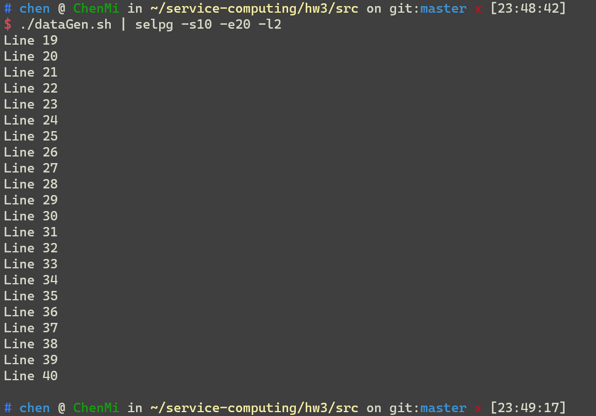
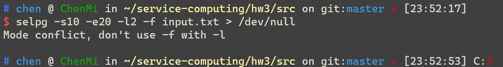
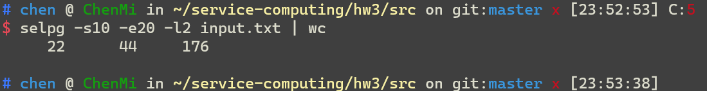
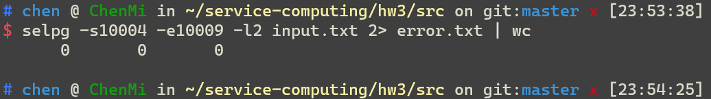

# Implementing CLI tool Selpg in Golang

## Introduction

**What's this :**  a CLI tool

**Level :** Learner project

**Function :** 

- Getting certain pages from a file or StdIn, 
- Print it on Stdout or send it to your other device. 
- A page could consist of fixed number(you choose) of lines or marked by '**/f**'

## Usage 


Go to the program directory and type in this in terminal,
```sh
$ ./selpg -h
```

And you will get help infomation:

```
$ ./selpg -h               
Usage:
  selpg [OPTIONS]

Application Options:
  -s=         Start page
  -e=         End page
  -l=         How many lines in a page (default: 72)
  -f          Using /f as page
  -d=         Send pages to ? instead of os.Stdout

Help Options:
  -h, --help  Show this help message
```

Yep, that's how you gonna use it.

## Tests

For better testing, a few test files were prepared:


- output.txt to test receiving result
- error.txt to receive the error message 
- input.txt contains 1000 lines of data
- dataGen generates the same result as input.txt, acting as an input command
```sh
#!/bin/bash  
for i in {1..1000}  
do  
echo Line $i;  
done  
```


### Case 1
```sh
$ ./selpg -s1 -e1 input.txt
```


For better display, will add -l for all remaining tests

### Case 2

```sh
$ ./selpg -s1 -e1 -l5 < input.txt
```


### Case 3 

Redirect other command's output as the input of selpg
```sh
$ ./dataGen.sh | ./selpg -s10 -e20 -l2
```




### Case 4
Write the result to a file, instead of printing it to stdout
```sh
$ ./selpg -s10 -e20 -l2 input.txt > output.txt 
```


nothing in terminal ?


already writen to file!


### Case 5 
Redirect error message from Stderr to error.txt

```sh
$ ./selpg -s20 -e10 -l2 input.txt 2> error.txt 
```
This command is obviously wrong as the startPageNumber is larger than the endPageNumber


Noting was printed


Error message was redirected to another file.


### Case 6

```sh
$ ./selpg -s10 -e20 -l2 input.txt > output.txt 2> error.txt 
```

The combination of above 2 commands, result as follow:


### Case 7 

```sh
$ ./selpg -s10 -e20 -l2 input.txt > output.txt 2> /dev/null
```

would drop error message, result same as above([case 6](#6)).


### Case 8

```sh
$ ./selpg -s10 -e20 -l2 -f input.txt > /dev/null
```

would drop output, show error message



### Case 9

```sh
$ ./selpg -s10 -e20 -l2 input.txt | wc  
```

This would redirect output of selpg command to **wc** as input, which gives the count of lines \ words \ chars.



### Case 10

```sh
$ ./selpg -s10004 -e10009 -l2 input.txt 2> error.txt | wc     
```

Similar to [9](#9), but redirect error message to error.txt.  
Here startPageNumber apparently exceeds input file, thus   
**wc** receives nothing and error message was sent.




### **One more thing**

Some important functions could not be shown:
- The function of **paging with '\f'** technically could not be shown, as '\f' could not be typed in .txt file.
- The function of **sending through pipe to devices** such as a printer could not be shown, as I don't have one.

## Implementation


### Pakages

Some official go packages, mostly about IO, and a **go-flags** package I found in github to replace **flag** package, for I found that the official flag package could do approximately nothing.

```go

import (
	"bufio"
	"fmt"
	"io"
	"io/ioutil"
	"log"
	"os"
	"os/exec"

	"github.com/jessevdk/go-flags"
)

```

### Flag design

```go
// Option describes The flags of SelPg
type Option struct {
	StartPg  int    `short:"s" required:"true" description:"Start page"`
	EndPg    int    `short:"e" required:"true" description:"End page"`
	LineOfPg int    `short:"l" default:"72" description:"How many lines in a page"`
	Fmode    bool   `short:"f" description:"Using /f as page "`
	Dest     string `short:"d" default:"" description:"Send pages to ? instead of os.Stdout"`
}
```

### Program structure

Referenced the provided c code
[selpg in c](https://www.ibm.com/developerworks/cn/linux/shell/clutil/selpg.c)

The stucture is almost illustrated in main function:


```go
func main() {
	processArgs()
	processInput()
}
```


1. Process the arguments, including options and potential filename. Throwing error if arguments illegal.
2. Process input (file or stdin), implementing the operation of selecting pages.

### Process Arguments


```go
func processArgs() {

	// remainingArgs are filenames
	remainingArgs, _ := flags.Parse(&opt)

	// -help
	if opt.StartPg == 0 && opt.EndPg == 0 {
		os.Exit(0)
	}

	// fileName given?
	if len(remainingArgs) == 0 {
		fileName = ""
	} else {
		fileName = remainingArgs[0]
	}

	lineCount := 0
	if fileName != "" {
		// open fileName -> f
		f, err := os.Open(fileName)
		if err != nil {
			fmt.Fprintf(os.Stderr, "Error: '%s' is Not a fileName \n", fileName)
			os.Exit(1)
		}
		defer f.Close()

		// get lineCount
		scanner := bufio.NewScanner(f)
		for scanner.Scan() {
			lineCount++
		}
	}

	// check arg negative
	if opt.StartPg < 0 {
		fmt.Fprintf(os.Stderr, "Error: page number < 0\n")
		os.Exit(2)
	}

	// check arg beyond lineCount
	if fileName != "" && !opt.Fmode && opt.EndPg > lineCount {
		fmt.Fprintf(os.Stderr, "Error: page number beyond file\n")
		os.Exit(3)
	}

	// check start > end
	if opt.StartPg > opt.EndPg {
		fmt.Fprintf(os.Stderr, "Error: startPage > endPage\n")
		os.Exit(4)
		//log.Fatal("Error: startPage > endPage")
	}

	// check mode conflict
	if opt.Fmode && opt.LineOfPg != 72 {
		fmt.Fprintf(os.Stderr, "Mode conflict, don't use -f with -l\n")
		os.Exit(5)
	}

}
```


### Process Input

Basically 3 parts:

1. **Write Destination** : Stdout **/** Specified Device -> writer  

    A little tricky, need to use Pipe.  
    The purpose of this part is to get **writer** (of type *bufio.Writer).

    ```go
    func processInput() {

        // write to ?
        // 1. Specified Device (dest)
        // 2. Stdout
        var writer *bufio.Writer
        if opt.Dest != "" {
            // 1. write to dest
            cmd := exec.Command("lp", fmt.Sprintf("-d%s", opt.Dest))
            stdinPipe, _ := cmd.StdinPipe()
            defer stdinPipe.Close()
            cmd.Stdout = os.Stdout
            writer = bufio.NewWriter(stdinPipe)
        } else {
            // 2. write to Stdout
            writer = bufio.NewWriter(os.Stdout)
        }
        defer writer.Flush()

    ```

2. **Read Source** : Stdin **/** Specified File -> file

    The goal of this part is to get **file** (of type *os.File) 
    - It would be pleasant if the filename is given -> Just open it using os.Open().  
    - For unifying the interfaces, even when no file was provided and we need to receive input from stdin, we would still try to get a *File, by creating a temporary file.
    
    ```go
        // Which file to use:
        // 1. If filename given : fileName
        // 2. Else : create a tempFile from Stdin
        var file *os.File
        if fileName != "" {
            // 1. given filename -> open file
            file, _ = os.Open(fileName)
        } else {
            // 2. stdin -> create a temp file
            file, _ = ioutil.TempFile("./", "temp")
            defer os.Remove(file.Name())

            tempScanner := bufio.NewScanner(os.Stdin)
            for tempScanner.Scan() {
                file.WriteString(tempScanner.Text())
                file.WriteString("\n")
            }

        }
        defer file.Close()
    ```

3. **Paging Mode** : '/f' Mode (Mode 2) **/** fixed lines Mode (Mode 1) 

    The logic of 'Page Selecting' is very simple : 
    - jumping the first few lines / pages of **file** (from step 2), 
    - then writing the coming few lines / pages of **file** to destination, by calling the **writer** (from step 1).

    ```go
        if opt.Fmode {
            // Mode 2 :
            // Paging with '/f'
            fReader := bufio.NewReader(file)

            // jump
            for i := 0; i < opt.StartPg; i++ {
                _, err := fReader.ReadString('\f')

                if err != nil || err == io.EOF {
                    log.Fatal(err)
                }
            }

            // write
            for i := opt.StartPg; i <= opt.EndPg; i++ {
                page, err := fReader.ReadString('\f')

                if err == nil || err == io.EOF {
                    writer.WriteString(page)
                    writer.WriteByte('\n')
                    if err == io.EOF {
                        break
                    }
                }

                if err != nil {
                    log.Fatal(err)
                }
            }
        } else {
            // Mode 1 :
            // Pages of fixed lines
            startLine := (opt.StartPg - 1) * opt.LineOfPg
            endLine := opt.EndPg*opt.LineOfPg - 1

            file, _ = os.Open(file.Name())
            scanner := bufio.NewScanner(file)

            // jump
            for i := 0; i < startLine; i++ {
                scanner.Scan()
            }

            // write
            for i := startLine; i <= endLine; i++ {
                scanner.Scan()
                writer.WriteString(scanner.Text())
                writer.WriteByte('\n')
            }

            if err := scanner.Err(); err != nil {
                log.Fatal(err)
            }

        }

    }

    ```

**BE VERY CAREFUL WHEN CODING:** It's incredibly easy to make fatal bugs when using any input methods implemented by **reader** class, especially when you want to read several files or read a file for multiple times.


